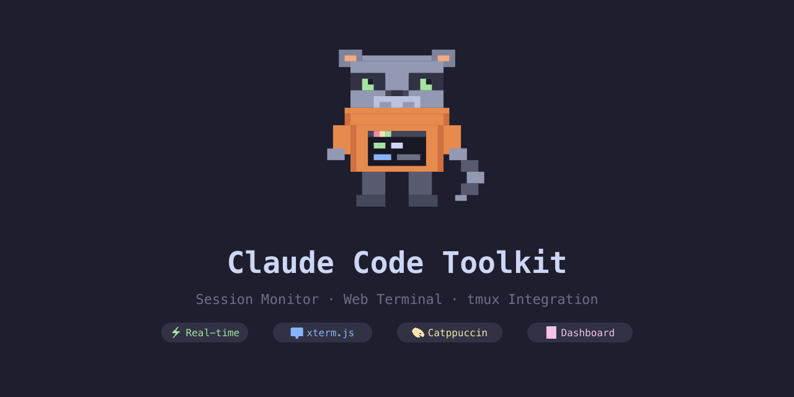

# Claude Code Toolkit

<p align="center">
  
</p>

[English](README.md) | [繁體中文](README.zh-TW.md)

> A collection of tools and utilities for enhancing the Claude Code CLI experience.

## Features

- **Custom status line** — model name, context usage bar, token count, estimated cost, git branch, and project name
- **5 color themes** — ansi-default, catppuccin-mocha, dracula, nord, none (+ NO_COLOR support)
- **Multi-instance dashboard** — live terminal view of all active Claude Code sessions
- **Web Dashboard** — real-time browser-based Session Monitor + Web Terminal (xterm.js)
- **tmux integration** — real-time session monitor on tmux status bar
- **One-click installer** — supports macOS, Ubuntu/Debian, CentOS/RHEL

After installation in tmux, you get both the Claude Code status line and a tmux session overview:

```
┌──────────────────────────────────────────────────────────────────────────────┐
│ $ claude                                                                     │
│                                                                              │
│ > Help me refactor the auth module                                           │
│                                                                              │
│ I'll start by reading the current auth implementation...                     │
│                                                                              │
│ Opus 4.6 │ [████████░░░░░░░░░░░░] │ 42% │ 85.2k tokens │  main │ my-proj     │
├──────────────────────────────────────────────────────────────────────────────┤
│ [0] zsh           [1] claude*                                   13 Mar 10:30 │
│ Claude: ⚡my-proj 42% │ 💤api-server 18% │ 💤docs 7%                          │
└──────────────────────────────────────────────────────────────────────────────┘
 ↑ Claude Code status line (inside CLI)    ↑ tmux bar: all sessions at a glance
```

## Quick Start

### One-line install

```bash
curl -fsSL https://raw.githubusercontent.com/kayhaowu/claude-code-toolkit/main/install.sh | bash
```

Then enable the modules you want:

```bash
bash ~/.claude-code-toolkit/statusline/install.sh   # Status line + tmux
bash ~/.claude-code-toolkit/hooks/install.sh         # Safety hooks
```

### Install from a local clone

```bash
git clone https://github.com/kayhaowu/claude-code-toolkit.git
cd claude-code-toolkit
bash statusline/install.sh
```

Restart Claude Code after installation. If you're inside tmux, the session monitor appears automatically.

### Uninstall

```bash
bash ~/.claude-code-toolkit/uninstall.sh
```

### Deploy to a remote Linux host

No need to clone on the remote — run from your local machine:

```bash
bash tmux/deploy.sh user@host
```

This deploys tmux + Catppuccin theme + plugins via SSH, and asks if you also want to install Claude Code statusline.

### System Requirements

| System | Requirement |
|--------|-------------|
| macOS | [Homebrew](https://brew.sh) |
| Ubuntu / Debian | sudo access |
| CentOS / RHEL | sudo access |

## Themes

Set the theme via the `CLAUDE_STATUSLINE_THEME` environment variable in your shell config (`~/.zshrc` or `~/.bashrc`):

```bash
export CLAUDE_STATUSLINE_THEME="catppuccin-mocha"
```

| Theme | Description | Color Type |
|-------|-------------|------------|
| `ansi-default` | Default theme using standard ANSI colors | 4-bit ANSI |
| `catppuccin-mocha` | Catppuccin Mocha palette, soft pastel style | 24-bit TrueColor |
| `dracula` | Dracula theme, high-contrast dark style | 24-bit TrueColor |
| `nord` | Nord theme, arctic blue tones | 24-bit TrueColor |
| `none` | No colors, plain text output | None |

## Dashboard

Monitor all active Claude Code sessions in a separate terminal:

```bash
sh ~/.claude/dashboard.sh
```

```
Claude Code Dashboard  2026-03-03 17:58:58  (every 2s)

PID      PROJECT            MODEL         STATUS    CONTEXT                     CTX%  OUTPUT   BRANCH
------   ----------------   ------------  -------   ------------------------    ----  ------   ----------
730419   sonic_docs         Opus 4.6      WORKING   [████████░░░░░░░░░░░░░░░░]  21%   2.6k     master
  » Now I have everything I need. Let me write the final plan.
582572   laas_agent         Opus 4.6      WORKING   [████████░░░░░░░░░░░░░░░░]  34%   10.2k    main
26983    ubuntu             Opus 4.6      IDLE      [████░░░░░░░░░░░░░░░░░░░░]  14%   2.8k

────────────────────────────────────────────────────────────────────────────────
Instances: 3  Context: 128.4k  Output: 15.6k  Mem: 1.4G
```

Updates every 2 seconds. Press `Ctrl+C` to exit.

## Web Dashboard

A browser-based dashboard for monitoring Claude Code sessions and accessing terminals remotely.

**Session Monitor** — real-time cards showing PID, project, model, tokens, cost, git branch, tmux window, and status (working/idle/stopped). Status filter and search. Connection status banner.

**Web Terminal** — click "Open Terminal" on any session card to attach to its tmux window via xterm.js. Catppuccin Mocha theme, Nerd Font icons, split pane support, 24-bit true color.

### Quick Start

```bash
cd dashboard/backend && pnpm install
cd ../frontend && pnpm install && pnpm build
cd ../backend && pnpm dev
```

Open http://127.0.0.1:3141

### Docker

```bash
cd dashboard && docker compose up -d
```

Local-only access (binds to `127.0.0.1:3141`). Requires Node.js >= 24.

See [`docs/superpowers/specs/2026-03-15-dashboard-integration-design.md`](docs/superpowers/specs/2026-03-15-dashboard-integration-design.md) for full design documentation.

## tmux Integration

Running `statusline/install.sh` inside a tmux session automatically configures the session monitor on the second status line. It auto-detects Catppuccin themes and uses matching colors; otherwise falls back to default colors.

Status detection is **event-driven** via Claude Code hooks (UserPromptSubmit, PostToolUse, Stop) — updates are near-instant, not polling-based. See [`statusline/README.md`](statusline/README.md#how-real-time-detection-works) for details.

### tmux Configuration (optional)

This repo also includes a complete Catppuccin Mocha tmux config. If you want the full tmux setup (theme, keybindings, plugins) in addition to the Claude statusline:

```bash
# Copy config and set up TPM
cp tmux/tmux.conf ~/.config/tmux/tmux.conf
ln -sf ~/.config/tmux ~/.tmux
git clone https://github.com/tmux-plugins/tpm ~/.config/tmux/plugins/tpm

# Start tmux and press Ctrl-a + I to install plugins
```

See [`tmux/README.md`](tmux/README.md) for keybindings, plugins, and details.

## Hooks

Ready-to-use hook scripts for Claude Code automation:

| Hook | Event | Description |
|------|-------|-------------|
| `safety-guard` | PreToolUse | Block dangerous commands (rm -rf /, force push, DROP TABLE) |
| `sensitive-files` | PreToolUse | Block access to .env, credentials, *.key files |
| `auto-format` | PostToolUse | Auto-format files after edit (prettier/black/gofmt/clang-format) |
| `notify-on-stop` | Stop | Desktop/tmux notification when Claude finishes |
| `context-alert` | Stop | Warn when context usage exceeds 80% |
| `usage-logger` | Session | Log session usage to `~/.claude/hooks/usage.jsonl` |

### Install Hooks

```bash
bash hooks/install.sh
```

Recommended hooks (notify-on-stop, safety-guard, sensitive-files) are enabled by default. Optional hooks (auto-format, usage-logger, context-alert) can be enabled during install. Scripts are symlinked so `git pull` auto-updates without re-installing.

See [`hooks/README.md`](hooks/README.md) for details.

## Configuration

| Environment Variable | Description | Default |
|---------------------|-------------|---------|
| `CLAUDE_STATUSLINE_THEME` | Color theme | `ansi-default` |
| `CLAUDE_STATUSLINE_SHOW_COST` | Show estimated API cost (`1` to enable) | `0` (off) |
| `NO_COLOR` | Disable all ANSI colors ([no-color.org](https://no-color.org)) | unset |

## Uninstall

```bash
bash statusline/uninstall.sh
```

See [`statusline/README.md`](statusline/README.md) for manual uninstall steps.

## Contributing

Issues and pull requests are welcome. Please describe the change and its motivation.

## License

[MIT](LICENSE)
